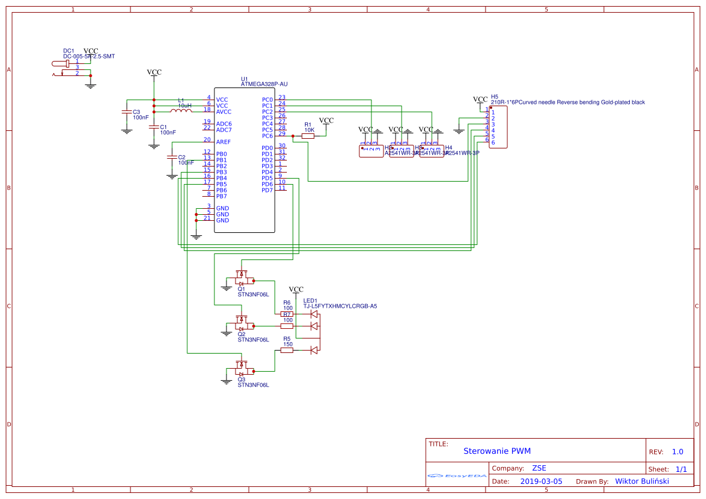
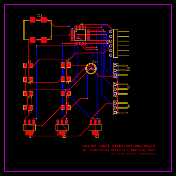

## Sterowanie LED metodą PWM
### Zasada działania:
PWM (ang. **P**ulse **W**idth **M**odulation) jest określeniem sygnału cyfrowego.
Najczęściej stosowany jest do sterowania szybkością serwo silnika, kontroli jasności oświetlenia czy w zasilaniu urządzeń. Sygnał ten podobny jest do sygnału
prostąkątnego. Przy stałej częstotliwości i amplitudzie generowane są impulsy
trwające pewną część okresu, nazywamy to wpółczynnikiem wypełnienia.  

Kontrolując współczynnik wypełnienienia wpływamy na średnią wartość napięcia
tym samym zmieniając moc wyjściową. Wynika to ze wzrou P = U·I gdzie pod
wartość napięcia podstawiamy jej średnią w okresie.


#### Sterowanie LED

Płytka badawcza posiada diodę RGB, której moc świecenia dla każdego koloru sterowana jest metodą PWM. Regulując odpowiednio wartość wypełnienia dla poszczególnych kolorów podstawowych; jesteśmy w stanie otrzymać dowolny kolor świecenia (paleta RGB posiada 16 777 216 teoretycznych kolorów).  
Regulacja odbywa sie przez podanie sygnału analogowego do mikrokontrolera który po przetworzeniu sygnału reaguje zmieniając współczynnik wypełnienia dla odpowiedniego koloru diody.

### Dokumentacja techniczna

#### Spis elementów elektronicznych

- Jednostka logiczna - **mikrokontroler Atmega328P-AU** - obudowa TQFP 32 piny
- **Dioda luminescencyjna RGB** o wspólnej anodzie (wyk. TJ-L5FYTXHMCYLCRGB-A5) - obudowa THT
- Tranzystor przełączający - **MOSFET z kanałem typu N** (wyk. STN3NF06L) - obudowa SOT-223 (x3)
- **Rezystor** regulujący napięcie diody **100Ω** - obudowa SMD1206
- **Rezystor** regulujący napięcie diody **150Ω** - obudowa SMD1206
- Elementy filtrujące zasilanie:
  - **Kondensator ceramiczny 100nF** - obudowa SMD1206 (x3)
  - **Dławik 10μH obudowa** - obudowa SMD1206
  - **Rezystor** podciągający napięcie pinu reset **10kΩ** - obudowa SMD1206
- Gniazda i wyprowadzenia:
  - **Gniazdo zasilające DC powerjack 2.5mm** - obudowa SMD
  - **Trój-pinowe wyprowadzenie na analogowy sygnał sterowania** - obudowa THT, raster 2.54mm (x3)
  - **Sześcio-pinowe Wyprowadzenie do programowania układu** - obudowa THT, raster 2.54mm

#### Program wykonawczy

```C
// Definicja pinów wyjściowych PWM
const int OutputR = 9;
const int OutputG = 5;
const int OutputB = 6;

// Definicja analogowych pinów wejściowych
const int InputR = A0;
const int InputG = A1;
const int InputB = A2;

// Wartości kolorów
int valueR = 0;
int valueG = 0;
int valueB = 0;

// Ustawnienie pinów wyjściowych na odpowiedni tryb
void setup() {
  pinMode(OutputR, OUTPUT);
  pinMode(OutputG, OUTPUT);
  pinMode(OutputB, OUTPUT);
}

void loop() {
  // Sprawdzanie wartości wejść analogowych i mapowanie ich na wartość 0-255 (PWM gdzie 255 odpowiada 100% wypełnieniu)
  valueR = map(analogRead(InputR), 0, 1023, 0, 255);
  valueG = map(analogRead(InputG), 0, 1023, 0, 255);
  valueB = map(analogRead(InputB), 0, 1023, 0, 255);
  
  // Ustawianie koloru na podstawie wartości analogowych
  setColor(valueR, valueG, valueB);
}

void setColor(int red, int green, int blue) {
  // Ustawianie odpowiedniego współczynnika wypełnienia dla każdego pinu
  analogWrite(OutputR, red);
  analogWrite(OutputG, green);
  analogWrite(OutputB, blue);
}
```

#### Schemat elektroniczny


#### Schemat PCB

